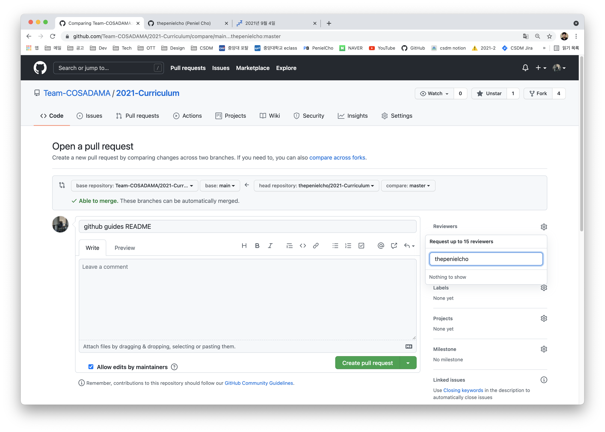

# 포스팅하는 방법 (for Members)

코사다마 블로그에 포스팅하는 방법에 대해 알려 드리겠습니다.
꼼꼼히 읽어보시어 에러 없이 성공적인 포스팅하시길 바라요 😆

## 들어가기 전에
- 포스팅 방법을 알기 전, 본 블로그 프로젝트의 디렉토리 구조를 짚고 넘어 갈게요. 프로젝트 폴더 내에는 assets, components, content, layouts, pages, static, store라는 폴더들이 있어요. 이 중 저희가 포스팅을 하며 사용할 폴더는 content와 static 폴더 밖에 없습니다. content 폴더 내에는 blog 폴더가 자리하고 있는데 저희는 이곳에 마크다운 파일을, static 폴더 내에는 마크다운 파일 이름과 같은 폴더를 만들어 그 안에 마크다운에서 사용하는 이미지들을 넣어줄 거에요.
- 본 작업은 [Team-COSADAMA](https://github.com/Team-COSADAMA) 계정의 [Blog Repository](https://github.com/Team-COSADAMA/Blog)를 fork한 후, 자신의 로컬 컴퓨터에 clone하여 clone한 working directory에서 이뤄져야 합니다. 일련의 과정이 익숙치 않은 분들은 지난 깃/깃헙 커리큘럼의 [깃헙 기능 살펴보기](https://github.com/Team-COSADAMA/2021-Curriculum/blob/main/GitHub-Guides/github-must-know-features.md) 파트를 참고해주세요. 과정 중 발생하는 에러는 슬랙 채널을 통해 질문해주세요.

## 블로그 포스팅(.md) 파일 작성하는 법
1. 블로그 포스팅은 마크다운(.md 확장자)으로 작성합니다. 

    혹시 마크다운 사용법이 기억나지 않으시는 분들은 지난 깃/깃헙 커리큘럼 사전 과제 [마크다운 공부하기 등](https://cosadama.notion.site/b1f2d31abeae47e1ae3f49b28abfa897)을 참고해주세요. 파일명은 slug와 동일해야 합니다. 관련 내용은 3번에서 확인해주세요.

2. 블로그 포스팅 마크다운 파일은 content > blog 폴더에 위치합니다.

    꼭 content 폴더 안에 위치하는 blog 폴더 내에 마크다운 파일을 넣어주세요.

3. 마크다운 파일 맨 위에 포스팅 관련 세부 정보를 **반드시!** 적습니다.

    파일 맨 위에 위치하는 관련 세부정보가 없다면 블로그는 해당 글의 제목부터 위치, 대표 이미지 등을 발견하지 못하고 에러를 발생시킵니다. 포스팅을 모두 작성하였다면 반드시 세부정보를 완전히 작성하였는지 확인해주세요. COCO 2021 홍보 포스팅을 예시로 기본 양식으로 사용하시면 됩니다.
    ```markdown
    ---

    title: COCO 2021 Invitation
    description: 코사다마의 두번째 컨퍼런스, COCO 2021에 당신을 초대합니다!
    slug: coco-2021-invitation
    img: coco-2021-invitation.png
    datetime: 2021. 08. 23.
    category: Events
    author: Staff

    ---
    ```
    세부 정보를 감싸는 ---는 자신이 감싸고 있는 부분이 세부 정보임을 의미하는 표시니 절대 지우시면 안됩니다!
    - title: 포스팅의 제목입니다. 내용을 직관적으로 나타낼 수 있도록 적어주세요. 한글, 영어 모두 좋습니다.
    - description: 포스팅에 대한 간단한 설명입니다. 2줄 이내로 적어주시면 됩니다. SNS에 공유될 경우 URL. 메인이미지, 제목과 함께 시각화됩니다. 추후 메인페이지에 포스팅 설명으로 추가될 수도 있습니다.
    - slug: 쉽게 말해 해당 포스트가 갖게 될 URL의 일부분입니다. 메인 도메인 / slug라고 생각하시면 돼요. 위 예시의 경우 slug에 따라 포스팅 URL이 www.blog.cosadama.com/coco-2021-invitation 입니다. 주의하셔야 하는 점은 본 마크다운 파일의 이름이 slug와 동일해야 하며, static 폴더 내에 생성될 본 포스팅 용 이미지 폴더 이름도 slug와 동일해야 합니다.
    - img: 메인 페이지에 사용되는 미리보기용 이미지입니다. 이 이미지의 경우 디자인의 통일성을 위해 제가 직접 제작 후 업로드 예정이므로, 일괄적으로 not-yet-generated.png라 적어주시면 됩니다.
    - datetime: 업로드 일자를 적어주시면 됩니다. 연도. 월. 일. 형식으로 적어주시면 됩니다. 연도의 경우 네자리, 월일의 경우 두자리로 적어주세요.(ex - 2021. 09. 05.)
    - category: 아직 명확히 카테고리 체계를 정하지는 못했습니다. 제가 추후 일괄적으로 수정할 예정이니 현재는 데이터 분석 글의 경우 Data Analysis, 에러 해결 방법에 관한 글의 경우 Debugging으로 적어주세요. 또한 특정 툴 사용법 등에 대한 정보 전달 글의 경우 툴의 이름(GitHub, Selenium, Scrapy 등)을 카테고리 명으로 적어주시면 되겠습니다.
    - author: 작성자 이름을 적어주시면 됩니다. 작성자가 여러명일 경우 이수만, 유영진 이런 식으로 쉼표 후 띄어쓰기 하여 적어주시면 됩니다.


4. 본문에 제목은 적지 않습니다.

    제목은 위 세부 정보 중 title을 읽어 포스팅 맨 위에 가장 크게 표시될 예정이니 따로 적지 말아주세요.

5. 헤딩은 h2~h4 사이에서만 사용합니다.

    헤딩(Heading)은 h1(#)은 사용하지 않고 h2(##), h3(###), h4(####)만 사용합니다.

6. 마크다운 파일 내에서 html 태그를 사용하지 않습니다.

    띄어쓰기를 위한 br 태그, 각종 스타일링을 위한 클래스 등을 사용하지 말아주세요. 이미 블로그의 기본 세팅을 통해 스타일링이 지정된 상태입니다. 띄어쓰기는 엔터 두번을 치시면 됩니다.

7. 이미지 삽입 시 경로는 (/slug명/이미지명.확장자) 입니다.

    가장 당부드리고 싶은 내용입니다. 마크다운 내 이미지를 삽입할 시, 경로는 (/해당 포스팅 마크다운의 slug명/이미지 파일 명.확장자) 입니다.예시는 아래와 같습니다.
    ```markdown
    
    ```

## 이미지 폴더 위치시키기
위에서 블로그 포스팅 내 이미지의 경로를 지정해줬죠? 이제 해당 경로에 이미지들을 위치시켜 봅시다. 먼저 static 폴더 내에 해당 포스팅의 slug명과 동일한 폴더를 만들어주세요. 폴더가 생성되었다면, 해당 폴더 내에 블로그 포스팅 내에서 사용될 이미지들을 넣어주세요. 모두 제대로 위치했는지, 오타는 없는지 확인만 해주면 완료! 

Nuxt의 경우 특이하게 포스팅에 사용되는 마크다운 확장자 파일의 경우 이미지 패스가 static 폴더로 시작하기 때문에 /slug명/파일명.png의 구조를 취해도 static 폴더 내에서 원하는 이미지들을 골라올 수 있는 것이랍니다.

## 블로그 포스팅 업로드하는 법
마크다운 파일과 이미지용 폴더도 모두 제 위치에 넣어두셨다면, 업로드를 시작해봅시다. fork된 레포지토리에 포스팅 관련 파일 변화들을 커밋 및 푸쉬한 후, 풀 리퀘스트를 열어 오리지널 레포지토리에 병합 요청을 하는 방식으로 업로드를 진행해주셔야 합니다. 아래에서 자세히 설명 드릴게요.

1. ~/content/blog 폴더 내에 포스팅 용 마크다운 파일을 잘 넣어뒀고, static 폴더 안에 포스팅 전용 폴더를 만들어 그 내부에 포스팅 파일에서 사용한 이미지들을 잘 넣어두었다면 첫 단계는 완료입니다. 혹시나 위치 오류나 오타는 없는지 다시 한번 잘 체크해주세요.

2. 오타가 없다면, 여러분이 fork한 레포지토리에 commit 및 push해주시면 돼요. 아래 순서로 add부터 push까지 완료해주세요.
    ```shell
    git add .
    git commit -m "커밋 내용"
    git push origin main
    ```

3. 이제 pull request를 열어봅시다. push가 성공적으로 완료되었다면, 자신의 fork된 레포지토리에 아래와 같은 문구가 보일 거에요.


    this branch is 1 commit ahead of ~ 라는 문구가요. 오리지널 레포지토리에 없던 변화가 생겼으니 당연하겠죠? 우측에 위치한 contribute를 눌러 open pull request 버튼을 클릭해주세요.

4. 그럼 아래와 같은 화면이 뜰 거에요. create pull request를 눌러줍니다.


5. 이제 Open a pull request라는 제목의 화면이 보이는데, 여기서 커밋의 제목을 수정하거나 덧붙이고 싶으신 내용을 leave a comment 부분에 적어주세요. 완료하셨다면, 우측에 위치한 Reviewrs를 클릭해주세요. 그럼 검색창이 나오는데, 여기서 thepenielcho를 검색하여 저(thepenielcho)를 reviewer로 지정해주세요. 여러분의 커밋에 오류는 없는지, 파일 구조는 정확한지, 병합 시 문제될 요소는 없는지 확인 후 문제가 없다면 포스트 업로드를 승인할 예정입니다. Reviewer 지정까지 완료하였다면 아래에 있는 Create pull request 버튼을 눌러주세요. 그럼 정말 끝! 혹시나 양식을 지키지 않으셨거나, 파일 구조가 잘못 되었을 경우 제가 풀리퀘를 취소하고 다시 업로드를 요청드릴 수 있습니다.



궁금하신 점은 슬랙 채널을 통해 언제나 편하게 질문 주세요. 자! 그럼 앞으로 활발한 포스팅 업로드 부탁 드려요 😆